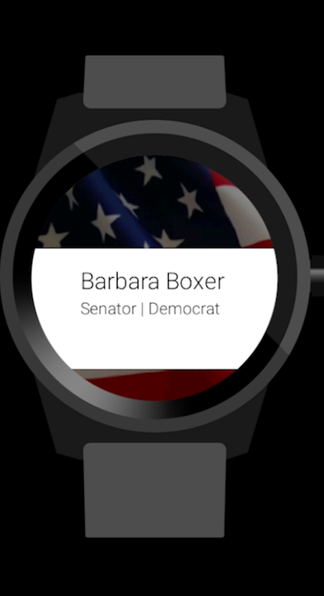

# PROG 02: Represent!

Represent is an app that allows you to see representatives in a certain area.

## Authors

Simon Cao ([scsmncao@berkeley.edu](mailto:scsmncao@berkeley.edu))

## Demo Video

See [Represent Video] (https://www.youtube.com/watch?v=sLWGrmU-TiA&feature=youtu.be)

## Screenshots

## Acknowledgments

* Hat tip to anyone who's code was used
* Any other support

Extra thanks to StackOverflow like always.
