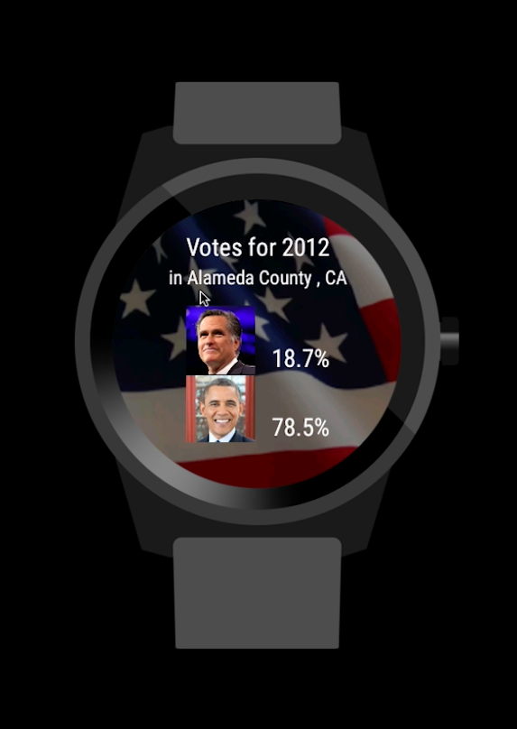

# PROG 02: Represent!

Represent is an app that allows you to see representatives in a certain area.

Features:

* All Views: Mobile: Main, Congressional, Detailed; Watch: Main, 2012 Vote
* Input current location or zip and will come up with watch view
* Renders all information
* swipe through congressional reps
* selecting a member of congress on watch will open up detail view on phone
* changing the location will change the vote view
* changing accelerometer will change to a random zip

## Authors

Simon Cao ([scsmncao@berkeley.edu](mailto:scsmncao@berkeley.edu))

## Demo Video

See [Represent Video] (https://www.youtube.com/watch?v=TTv7dreNb2A&feature=youtu.be)

## Screenshots

## Acknowledgments

* Hat tip to anyone who's code was used
* Any other support

Extra thanks to StackOverflow like always.
